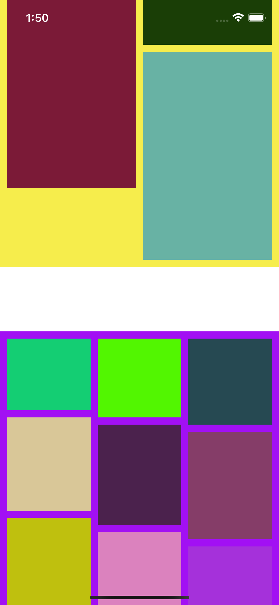

## Features
- Support custom UICollectionView properties of each section, such as background color
- Waterfall support



## Usage

[Example](./Example/HTCollectionFallLayout/HTViewController.m)

```ruby
pod 'HTCollectionFallLayout', :git => 'https://github.com/hellohublot/HTCollectionFallLayout.git'
```
```objective-c
- (void)registerClass:(nullable Class)viewClass forDecorationViewOfKind:(NSString *)elementKind;

- (nullable UICollectionViewLayoutAttributes *)collectionView:(UICollectionView *)collectionView layout:(UICollectionViewLayout *)collectionViewLayout layoutAttributesForDecorationViewInSection:(NSInteger)section sectionContentMinY:(CGFloat)minY sectionContentMaxY:(CGFloat)maxY {
	HTCollectionViewLayoutAttributes *attributes = [HTCollectionViewLayoutAttributes layoutAttributesForDecorationViewOfKind:NSStringFromClass([HTSectionDecorationView class]) withIndexPath:[NSIndexPath indexPathForRow:0 inSection:section]];
    attributes.frame = CGRectMake(0, minY, collectionView.bounds.size.width, maxY - minY - 10);
    attributes.zIndex = -1;
    attributes.model = [UIColor blueColor];
    return attributes;
}

- (void)applyLayoutAttributes:(UICollectionViewLayoutAttributes *)layoutAttributes {
    HTCollectionViewLayoutAttributes *attributes = (HTCollectionViewLayoutAttributes *)layoutAttributes;
    self.backgroundColor = attributes.model;
}
```

## Author

hellohublot, hublot@aliyun.com
